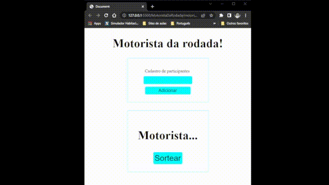

# MotoristaDaRodada

### Página para selecionar o motorista da vez na roda de amigos nos seus **Happy Hour**!!!

## Tecnologias usadas

Foi usada **HTML**, **CSS**, e **JavaScript Vanilla** para criar essa página.

## Explicação 

A partir do clique no botão adicionar, seleciona-se o valor (nome dos participantes) digitado e cria-se um **Array** e os adicionam. 
Ao mesmo tempo que os colocam em uma **Div** mostrando para o usuário os nomes que estão sendo adicionados.
Para assim fazer um sorteio aleátorio utilizando métodos do **Math** e mostrar o sorteado.

